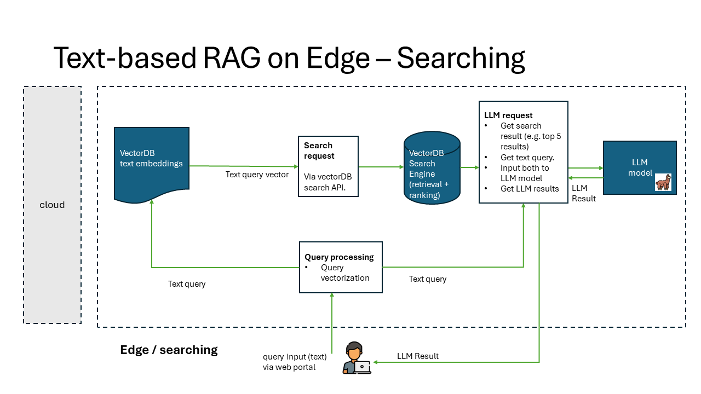

# Retrieval-Augmented Generation (RAG) on Edge  

RAG on Edge is a tool to perform text searches within files using a vector-based approach, and generate a readable response based on the search result with Large Language Model.

The solution is independent from cloud services, and can be deployed to the edge device with either CPU only or a combination of CPU+GPU. The messaging system follows a pub/sub pattern, ensuring adaptability to diverse edge computing scenarios.

The solution currently supports the text-based query, and will be extended to support multi-modality (text, image, video and audio) search and generation in our next plan.

## Architecture

### Architecture Diagrams

RAG solution is typically comprised with 2 processes: Indexing and Searching.
- Indexing is the process of creating a vector representation of the data.
- Searching is the process of finding the most similar vectors to a given query vector.




The implementation of RAG on Edge solution is composed of 5 components:

- rag-on-edge-web: a web application to interact with the user to submit the search and generation query
- rag-on-edge-interface: an interface module to interact with web frontend and the backend components.
- rag-on-edge-pubsub-broker: a pub/sub message broker for message passing between the components. currently we use Azure IoT Operations(AIO) MQ broker as the message broker. The broker can be also replaced with other messaging brokers. DAPR sidecar is used to interact with the broker.
- rag-on-edge-vectorDB: a database to store the vectors. currently we use [Chroma DB](https://www.trychroma.com/) as the vector database. The database can be also replaced with other vector databases.
- rag-on-edge-LLM: a large language model(LLM) to generate the response based on the vector search result. currently we use [LLama2 model](https://ai.meta.com/llama/) as the LLM. It can be also replaced with other open sourced LLM model fit for edge inference.

### Messaging Design

As pub/sub pattern is commonly used in edge computing. We design a pub/sub messaging pattern in the RAG on edge solution to unlock the potential edge computing scenarios with the benefits as below.

The pub/sub pattern is implemented with Azure IoT Operations(AIO) MQ broker and DAPR sidecar.


Pub/Sub pattern has the following benefits:

- Decoupling of Components:
Publishers and subscribers don't need to be aware of each other's existence. It's easier to add or remove components without affecting the others.
- Scalability & flexibility:
Enabling the addition of new subscribers or dynamically remove without affecting existing components. each subscriber receives a copy of the message independently. allows for the creation of modular and extensible systems. Easy to maintain, extend and modify the system.
- Asynchronous Comm:
Useful in scenarios where components have varying processing speeds or availability
- Pub/sub is fundamental to event-driven architectures. user actions, system events, or data changes, can be broadcasted as messages, and Subscribers can then react to these events without direct communication with the event source.
- Reliability and Fault Tolerance:
Pub/sub systems can enhance the reliability and fault tolerance of a distributed system high availability. If a subscriber is temporarily unavailable, it can catch up on missed messages when it becomes available again.
- Broadcasting and Filtering:
Enables efficient message filtering based on content or metadata.
- Pub/sub systems can be used for event logging and auditing, trace and analyze the sequence of events in a system.

## Getting Started

### Prerequisites

- An Azure subscription. If you don't have an Azure subscription, create a [free account](https://azure.microsoft.com/en-us/free/?WT.mc_id=A261C142F) before you begin.
- A Windows host machine with the spec that is capable to deploy AKSEE and AIO as indicated in the Installation below. You may use a VM or a physical machine.

### Installation

- Deploy AKSEE and AIO to your Windows host machine via following the instructions [here](https://learn.microsoft.com/en-us/azure/iot-operations/deploy-iot-ops/howto-prepare-cluster?tabs=aks-edge-essentials).

   AKSEE cluster should have 1 Linux node with following spec:
    - \>= than 8 vCPU (repo tested with 32 vCPU)
    - \> 64 GB RAM (repo tested with 128 GB RAM)
    - \> 400 GB disk (repo tested with 800 GB disk)

    For AIO installation for production, at least 8GB-to-16GB RAM, and a 4-core X64 CPU is required as indicated [here](https://engage.cloud.microsoft/main/threads/eyJfdHlwZSI6IlRocmVhZCIsImlkIjoiMjU3NzUwNzU3NzkxMzM0NCJ9?trk_copy_link=V1&domainRedirect=true).

### Quick Start

1. Download the repo to your local dev machine

    ```bash
    git clone <repo url>
    ```

2. Containerize each component: rag-on-edge-web, rag-on-edge-interface, rag-on-edge-vectorDB, rag-on-edge-LLM from the Dockerfile in the respective component folder.

For example:

```bash
cd rag-on-edge-web
docker build -t <CR_url>.rag-on-edge-web:latest .
```

If you want to modify the configuration before containerizing the code, check the details from the the READMEs in the respective component folder.
- [rag-on-edge-web README](./solution/rag-on-edge-web/README.md)
- [rag-on-edge-interface README](./solution/rag-on-edge-interface/README.md)
- [rag-on-edge-vectorDB README](./solution/rag-on-edge-vectorDB/README.md)
- [rag-on-edge-LLM README](./solution/rag-on-edge-LLM/README.md)

> **_NOTE:_**  Make sure to put LLM model files before containerizing the rag-on-edge-LLM component. See [rag-on-edge-LLM README](./solution/rag-on-edge-LLM/README.md).

3. Login your container registry and push the container image to the registry:

```bash
docker push <CR_url>.rag-on-edge-web:latest
```

4. Create a secret in the AKSEE cluster to access your container registry with the script provided:

```bash
./service-principal.sh
```

5. Deploy each component
    - rag-on-edge-web
    - rag-on-edge-interface
    - rag-on-edge-vectorDB
    - rag-on-edge-LLM
    
to the AKSEE cluster with /aio-dapr-deploy/xxx-dapr-workload.yaml from the respective component folder. Remember to modify the image name and cluster secret in the yaml file.

```bash
kubectl apply -f xxx-dapr-workload.yaml
```

6. Verify that all the components are deployed successfully on the AKSEE cluster without errors.

```bash
kubectl get pods -n < namespace >
kubectl get service -n < namespace >
kubectl describe pods <pod name> -n < namespace >
kubectl logs <pod name> <container name> -n < namespace >
```

7. Use below command to get web UI service external IP address and the port:

```bash
kubectl get service rag-web-service -n < namespace > -o jsonpath="{.status.loadBalancer.ingress[0].ip}:{.spec.ports[0].port}"
```

8. Open the web explorer on the Windows machine and paste the url http://< external IP address >:< port > to access the RAG on edge Web UI pages:

    - page-create-index: Input a new index name and create a new index in the vector database.
    - page-delete-index: Select an index name and delete it from the vector database.
    - page-upload-data: Select a pdf file from the Windows machine and upload the file to the vectorDB. The file will be chunking and embedding into the vectorDB.
    - page-vector-search-and-generate: Input your query, for example "what is the content about safety workspace in this document?", click search. The web app will send the query to the backend and get the response back from the backend. It usually takes around 20 seconds to get the response in this demo solution.

## Demo

A preliminary demo video can be found [here](https://microsoftapc-my.sharepoint.com/:v:/g/personal/chencheng_microsoft_com/EatJRpnHPclAuIY84No4zK8BTFIRtUhEEG62uMQAdas1jw?e=jcNZCT&nav=eyJyZWZlcnJhbEluZm8iOnsicmVmZXJyYWxBcHAiOiJTdHJlYW1XZWJBcHAiLCJyZWZlcnJhbFZpZXciOiJTaGFyZURpYWxvZy1MaW5rIiwicmVmZXJyYWxBcHBQbGF0Zm9ybSI6IldlYiIsInJlZmVycmFsTW9kZSI6InZpZXcifX0%3D).

## Resources
- [Nick287/AOAI-Azure-Search-PDF Repo Author: Bo Wang](https://github.com/Nick287/AOAI-Azure-Search-PDF/tree/chengc/integrate-llm-edge-solution-new)
- [DavidBurela/edgellm](https://github.com/DavidBurela/edgellm)
- [IaC for deploying a Windows VM](https://github.com/cse-labs/distributed-az-edge-framework/)
- [What Is Retrieval-Augmented Generation (RAG)](https://www.oracle.com/sg/artificial-intelligence/generative-ai/retrieval-augmented-generation-rag/)
- [What is vector search](https://www.algolia.com/blog/ai/what-is-vector-search/?utm_source=google&utm_medium=paid_search&utm_campaign=rl_emea_search_dstalg_nb_dynamic&utm_content=blog_ai_dynamic&utm_term=&utm_region=emea&utm_model=nonbrand&utm_ag=rl&utm_camp_parent=slg&utm_2nd_camp=dstalg&_bt=677640514505&_bm=&_bn=g&gad_source=1&gclid=EAIaIQobChMIr9aMkaHDgwMV06tmAh1hXQH8EAAYASAAEgIY_fD_BwE)
- [Design Patterns: Publisher-Subscriber pattern](https://learn.microsoft.com/en-us/azure/architecture/patterns/publisher-subscriber)
- [What is MQTT and How Does it Work](https://www.techtarget.com/iotagenda/definition/MQTT-MQ-Telemetry-Transport)

