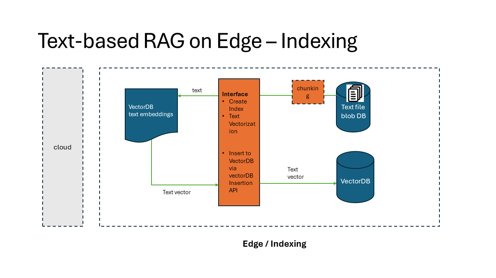
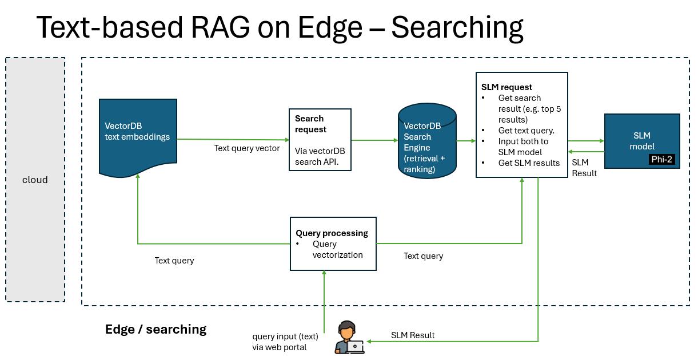
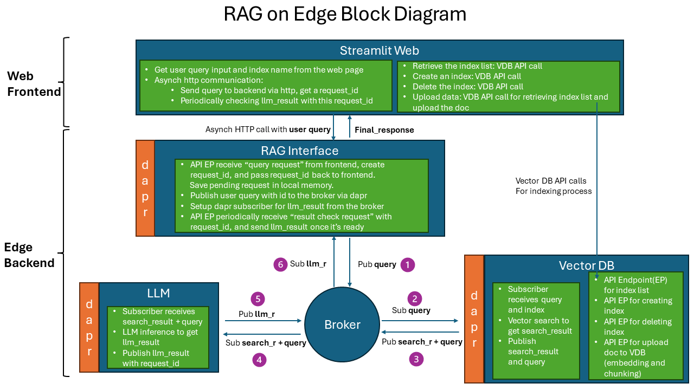
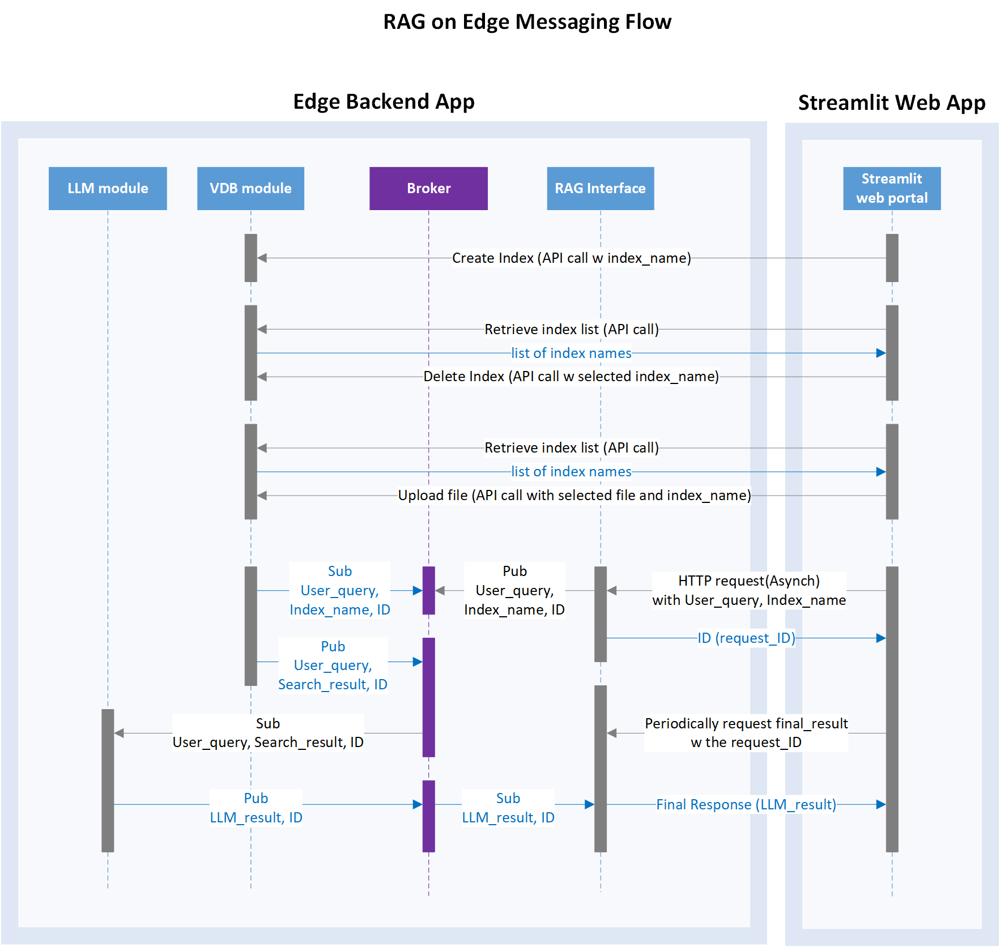

# Retrieval-Augmented Generation (RAG) on Edge with Small Language Models (SLM)

In this branch, RAG on Edge performs text searches within files using a vector-based approach, and generate a readable response based on the search result with Small Language Model [Phi2](https://www.microsoft.com/en-us/research/blog/phi-2-the-surprising-power-of-small-language-models/).

The solution is independent from cloud services, and can be deployed to the edge device with either CPU only or a combination of CPU+GPU. The messaging system follows a pub/sub pattern, ensuring adaptability to diverse edge computing scenarios.

## Architecture

### Architecture Diagrams

RAG solution is typically comprised with 2 processes: Indexing and Searching.

- Indexing is the process of creating a vector representation of the data.
- Searching is the process of finding the most similar vectors to a given query vector.




The implementation of RAG on Edge solution is composed of 5 components:

- rag-on-edge-web: a web application to interact with the user to submit the search and generation query.
- rag-on-edge-interface: an interface module to interact with web frontend and the backend components.
- rag-on-edge-pubsub-broker: a pub/sub message broker for message passing between the components. currently we use Azure IoT Operations MQ broker as the message broker. The broker can be also replaced with other messaging brokers. DAPR sidecar is used to interact with the broker.
- rag-on-edge-vectorDB: a database to store the vectors. currently we use [Chroma DB](https://www.trychroma.com/) as the vector database. The database can be also replaced with other vector databases.
- rag-on-edge-SLM-Phi2: a small language model (SLM) to generate the response based on the vector search result. We use [Phi2](https://www.microsoft.com/en-us/research/blog/phi-2-the-surprising-power-of-small-language-models/). It can be also replaced with other open sourced SLM model fit for edge inference.

### Messaging Design

As pub/sub pattern is commonly used in edge computing. We design a pub/sub messaging pattern in the RAG on edge solution to unlock the potential edge computing scenarios with the benefits as below.

The pub/sub pattern is implemented with Azure IoT Operations (AIO) MQ broker and DAPR sidecar.





Pub/Sub pattern has the following benefits:

- Decoupling of Components:
Publishers and subscribers don't need to be aware of each other's existence. It's easier to add or remove components without affecting the others.
- Scalability & flexibility:
Enabling the addition of new subscribers or dynamically remove without affecting existing components. each subscriber receives a copy of the message independently. allows for the creation of modular and extensible systems. Easy to maintain, extend and modify the system.
- Asynchronous Comm:
Useful in scenarios where components have varying processing speeds or availability.
- Pub/sub is fundamental to event-driven architectures. user actions, system events, or data changes, can be broadcasted as messages, and Subscribers can then react to these events without direct communication with the event source.
- Reliability and Fault Tolerance:
Pub/sub systems can enhance the reliability and fault tolerance of a distributed system high availability. If a subscriber is temporarily unavailable, it can catch up on missed messages when it becomes available again.
- Broadcasting and Filtering:
Enables efficient message filtering based on content or metadata.
- Pub/sub systems can be used for event logging and auditing, trace and analyze the sequence of events in a system.

## Getting Started

### Prerequisites

- An Azure subscription. If you don't have an Azure subscription, create a [free account](https://azure.microsoft.com/en-us/free/?WT.mc_id=A261C142F) before you begin.
- An Azure Container Registry.

- On developer machine:

  - Docker engine
  - Visual Studio Code
  - Azure CLI
  - Bash terminal (WSL on Windows)
  - Helm CLI
  - Kubectl CLI

- A Windows host machine capable of running deploy AKS Edge Essentials and Azure IoT Operations with the specs below. You may use a VM or a physical machine.
The solution was tested on Azure Windows VM size Standard D48ds v5, OS version 2022-datacenter-g2. If you are using an Azure VM we recommend creating a new disk with the required size, and install AKS EE on that disk.

   AKS EE cluster should have 1 Linux node with following specs:
    - \>= than 8 vCPU (repo tested with 32 vCPU)
    - \> 64 GB RAM (repo tested with 128 GB RAM)
    - \> 400 GB disk (repo tested with 800 GB disk)

### Installation

- Deploy AKS Edge Essentials to your Windows VM and adapt default configuration to the larger sizing required to run this solution.

  - Install AKE Edge Essentials runtime and setup the machine following [Prepare your machines for AKS Edge Essentials](https://learn.microsoft.com/en-us/azure/aks/hybrid/aks-edge-howto-setup-machine). Use the [Azure IoT Operations Preview validated installer](https://aka.ms/aks-edge/msi-k3s-1.2.414.0). If you are using a data disk other than `C:\` drive, ensure you install AKS EE with the `INSTALLDIR` and `VHDXDIR` options.
  - Setup AKS EE on your machine: complete the steps in [Create a single machine deployment](https://learn.microsoft.com/en-us/azure/aks/hybrid/aks-edge-howto-single-node-deployment).
    - At the end of Step 1: single machine configuration parameters, modify the following values in the `aksedge-config.json` file with your settings in the following properties:

    ```json
        "ServiceIPRangeSize": 10
        //...
        "CpuCount": 32,
        "MemoryInMB": 131072,
        "DataSizeInGB": 400,
    ```

    - Install `local-path` storage in the cluster by running the following command:

      ```powershell
      kubectl apply -f https://raw.githubusercontent.com/Azure/AKS-Edge/main/samples/storage/local-path-provisioner/local-path-storage.yaml
      ```

- Connect the AKS EE Kubernetes cluster to Azure Arc, see [Connect your AKS Edge Essentials cluster to Arc](https://learn.microsoft.com/en-us/azure/aks/hybrid/aks-edge-howto-connect-to-arc).
- Deploy Azure IoT IoT Operations Preview to your cluster via following the instructions [here](https://learn.microsoft.com/en-us/azure/iot-operations/deploy-iot-ops/howto-deploy-iot-operations?tabs=cli).

> [!TIP]
> Recommended: if you would like to remotely connect from your developer machine into the Kubernetes cluster, please follow the steps in [Use cluster connect to securely connect to Azure Arc-enabled Kubernetes clusters](https://learn.microsoft.com/en-us/azure/azure-arc/kubernetes/cluster-connect?tabs=azure-cli%2Cagent-version). Further steps in the Quick start assume connecting to the cluster from your local developer machine.

### Quick Start

1. Download the repo to your local dev machine.

  ```bash
  git clone <repo url>
  ```

2. Prepare environment variables, adapt the following and run in your bash terminal:

  ```bash
  export ACR_NAME="<update this>" # Existing Azure Container registry
  export ACR_HOST="<update this>" # Login server host in the form xxx.azurecr.io
  export SERVICE_PRINCIPAL_NAME="<your choice>" # used to create a new service principal to access ACR
  export SECRET_NAME="acrsecret" # name of the secret in the cluster, update if desired
  export NAMESPACE="azure-iot-operations" # leave default
  ```

3. Containerize each component: rag-on-edge-web, rag-on-edge-interface, rag-on-edge-vectorDB, rag-on-edge-LLM from the Dockerfile in the respective component folder.

> [!IMPORTANT]
> Make sure you download LLM model file before containerizing the rag-on-edge-LLM component. See [rag-on-edge-LLM README](./src/rag-on-edge-LLM-32core/README.md).

```bash
cd src/rag-on-edge-web
docker build -t $ACR_HOST/rag-on-edge-web:latest .

cd src/rag-on-edge-interface/modules/RAGInterface
docker build -t $ACR_HOST/rag-on-edge-interface:latest .

cd src/rag-on-edge-vectorDB/modules/VDBModule
docker build -t $ACR_HOST/rag-on-edge-vectordb:latest .

cd src/rag-on-edge-LLM-32core/modules/LLMModule
docker build -t $ACR_HOST/rag-on-edge-llm:latest .
```

If you want to modify the configuration before containerizing the code, check the details from the the READMEs in the respective component folder.

- [rag-on-edge-web README](./src/rag-on-edge-web/README.md)
- [rag-on-edge-interface README](./src/rag-on-edge-interface/README.md)
- [rag-on-edge-vectorDB README](./src/rag-on-edge-vectorDB/README.md)
- [rag-on-edge-LLM README](./src/rag-on-edge-LLM/README.md)

4. Login your Azure container registry and push the container images to your registry:

```bash
docker push $ACR_HOST/rag-on-edge-web:latest
docker push $ACR_HOST/rag-on-edge-interface:latest
docker push $ACR_HOST/rag-on-edge-vectordb:latest
docker push $ACR_HOST/rag-on-edge-llm:latest
```

5. Ensure you are remotely connected to the AKS EE Kubernetes cluster via Azure Arc. **In a separate Bash terminal** execute the cluster connect `proxy` command and leave it running. For more information see [Access your cluster from a client device](https://learn.microsoft.com/en-us/azure/azure-arc/kubernetes/cluster-connect?tabs=azure-cli%2Cagent-version#access-your-cluster-from-a-client-device). This will set your KUBECONFIG context.

  ```bash
  az connectedk8s proxy -n <your_arc_cluster_name> --resource-group <your_resource_group> --token "if connecting through service account"
  ```

6. Execute the following script to create a Service Principal in Azure, a secret in the AKS EE cluster to access your Azure container registry.

  ```bash
  ./deploy/service-principal.sh
  ```

7. Install Dapr runtime on the AKS EE cluster, for more information see [here](https://learn.microsoft.com/en-us/azure/iot-operations/develop/howto-develop-dapr-apps).

  ```bash
  helm repo add dapr https://dapr.github.io/helm-charts/
  helm repo update
  helm upgrade --install dapr dapr/dapr --version=1.11 --namespace dapr-system --create-namespace --wait
  ```

8. Deploy Azure IoT MQ - Dapr PubSub Component.

  ```bash
  kubectl apply -f ./deploy/yaml/rag-mq-components.yaml
  ```

9. Deploy each workload using `envsubst` for replacing Environment Variable names in the static YAML files. The variable names that will be replaced are `ACR_HOST` and `SECRET_NAME`.

```bash
envsubst < ./deploy/yaml/rag-vdb-dapr-workload.yaml | kubectl apply -f -

envsubst < ./deploy/yaml/rag-interface-dapr-workload.yaml | kubectl apply -f -

envsubst < ./deploy/yaml/rag-web-workload.yaml | kubectl apply -f -

envsubst < ./deploy/yaml/rag-llm-dapr-workload.yaml | kubectl apply -f -
```

10. Verify that all the components are deployed successfully on the AKS EE cluster without errors. Some of the workloads like the LLM model, are very large, and can take more than 60 minutes to deploy in the cluster depending on the internet connection.

```bash
kubectl get pods -n < namespace >
kubectl get service -n < namespace >
kubectl describe pods <pod name> -n < namespace >
kubectl logs <pod name> <container name> -n < namespace >
```

11. On the Windows AKS EE machine, use below command to get web UI service external IP address and the port:

  ```bash
  kubectl get service rag-web-service -n < namespace > -o jsonpath="{.status.loadBalancer.ingress[0].ip}:{.spec.ports[0].port}"
  ```

12. On the Windows AKS EE machine open the browser and go to `http://<External IP>:<PORT>` to access the RAG on edge Web UI pages. Optionally to browse from your local developer machine you can use [`port-forwarding`](https://kubernetes.io/docs/tasks/access-application-cluster/port-forward-access-application-cluster/#forward-a-local-port-to-a-port-on-the-pod).

    - page-create-index: Input a new index name and create a new index in the vector database.
    - page-delete-index: Select an index name and delete it from the vector database.
    - page-upload-data: Select a pdf file from the Windows machine and upload the file to the vectorDB. The file will be chunking and embedding into the vectorDB.
    - page-vector-search-and-generate: Input your query, for example "what is the content about safety workspace in this document?", click search. The web app will send the query to the backend and get the response back from the backend. It usually takes around 20 seconds to get the response in this demo solution.

## Resources

- [Nick287/AOAI-Azure-Search-PDF Repo Author: Bo Wang](https://github.com/Nick287/AOAI-Azure-Search-PDF/tree/chengc/integrate-llm-edge-solution-new)
- [DavidBurela/edgellm](https://github.com/DavidBurela/edgellm)
- [IaC for deploying Azure IoT Operations with Terraform](https://github.com/Azure-Samples/azure-edge-extensions-aio-iac-terraform)
- [What Is Retrieval-Augmented Generation (RAG)](https://www.oracle.com/sg/artificial-intelligence/generative-ai/retrieval-augmented-generation-rag/)
- [What is vector search](https://www.algolia.com/blog/ai/what-is-vector-search/?utm_source=google&utm_medium=paid_search&utm_campaign=rl_emea_search_dstalg_nb_dynamic&utm_content=blog_ai_dynamic&utm_term=&utm_region=emea&utm_model=nonbrand&utm_ag=rl&utm_camp_parent=slg&utm_2nd_camp=dstalg&_bt=677640514505&_bm=&_bn=g&gad_source=1&gclid=EAIaIQobChMIr9aMkaHDgwMV06tmAh1hXQH8EAAYASAAEgIY_fD_BwE)
- [Design Patterns: Publisher-Subscriber pattern](https://learn.microsoft.com/en-us/azure/architecture/patterns/publisher-subscriber)
- [What is MQTT and How Does it Work](https://www.techtarget.com/iotagenda/definition/MQTT-MQ-Telemetry-Transport)
